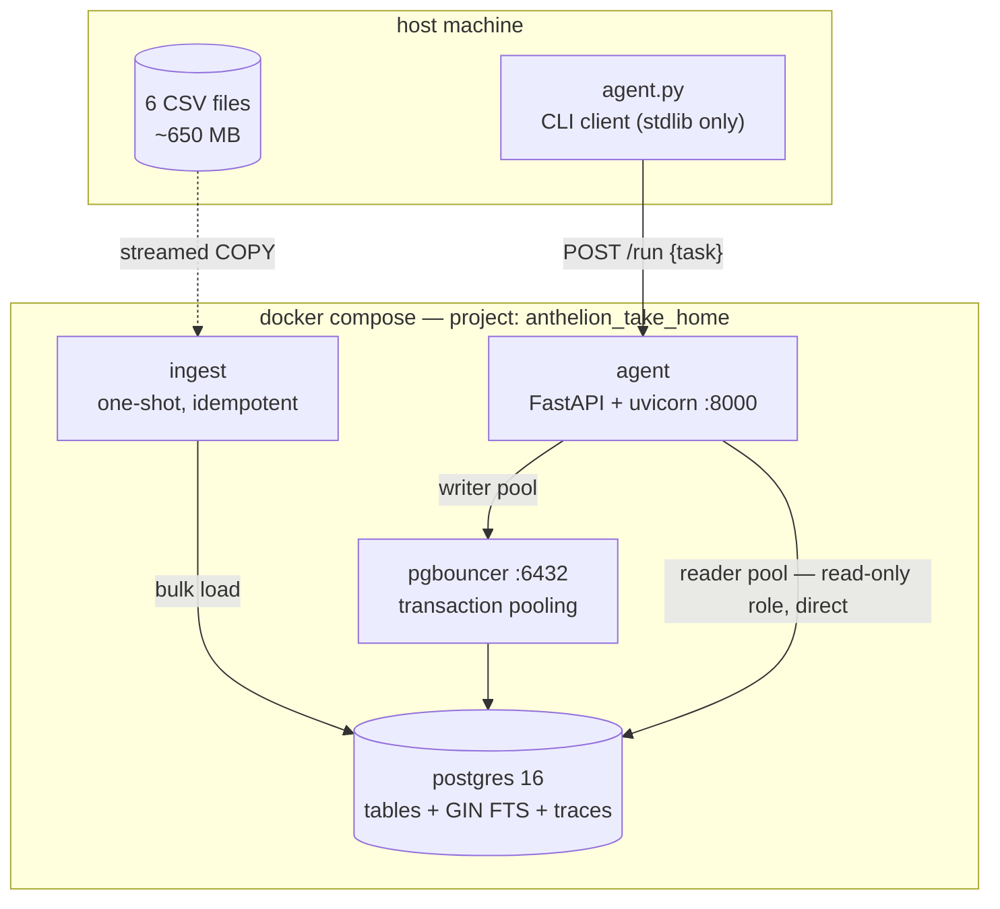
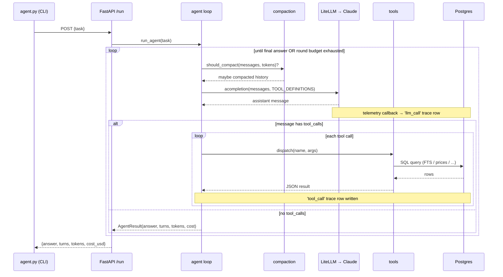
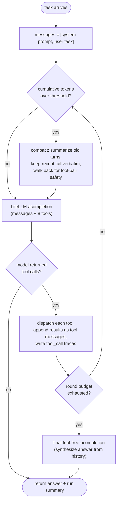
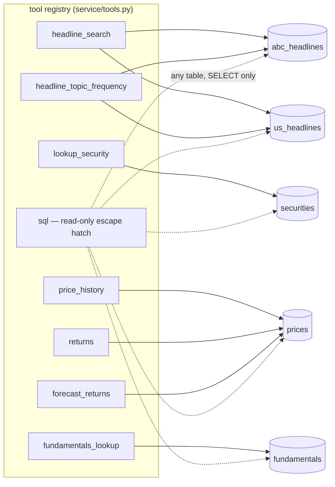

# Architecture (diagrams)

Visual companion to [WALKTHROUGH.md](WALKTHROUGH.md) (prose) and
[DECISIONS.md](DECISIONS.md) (rationale). All diagrams are Mermaid —
they render on GitHub and in most Markdown previewers.

---

## 1. Container topology

What runs where, and how the pieces connect, after `docker compose up`.

- **ingest** runs once, populates Postgres, exits. The agent service
  waits for it via `depends_on: service_completed_successfully`.
- The **writer pool** goes through pgbouncer (the hot path — production
  shape). The **reader pool** (used only by the `sql()` tool) connects
  directly as a read-only role with a statement timeout.

---

## 2. Request lifecycle — the agent loop

What happens for one `python agent.py "..."` invocation.

The loop is the core: call the model, run any tools it asked for, feed
results back, repeat. It ends when the model replies with no tool calls
(it has an answer); if the round budget runs out first, a final
tool-free call (diagram 3) synthesizes the answer from the history.

---

## 3. Agent loop — decision flow

The same loop as a flowchart, focused on the branch logic.

---

## 4. Tools → data

The 8 tools the model can call, and the tables they read.

The first 7 are structured, scoped tools. `sql()` is a guarded escape
hatch (read-only role, statement timeout, row cap) for anything the
structured tools don't cover.

---

## 5. Data model

```mermaid
erDiagram
    securities {
        text ticker PK
        text security_name
        text sector
        text sub_industry
    }
    prices {
        text ticker
        date date
        numeric close
        bigint volume
    }
    fundamentals {
        text ticker
        date period_end
        jsonb data
    }
    us_headlines {
        text source
        timestamptz published_at
        text headline
        text ticker
        tsvector headline_tsv
    }
    abc_headlines {
        date publish_date
        text headline
        tsvector headline_tsv
    }
    traces {
        uuid task_id
        int turn_index
        text kind
        jsonb prompt
        numeric cost_usd
    }

    securities ||--o{ prices : "ticker"
    securities ||--o{ fundamentals : "ticker"
    securities ||--o{ us_headlines : "ticker (soft link)"
```

- `abc_headlines` stands alone — Australian general news, no ticker.
- `us_headlines.ticker` is a *soft* link to `securities` (no FK; the
  upstream data isn't clean enough to enforce one).
- `traces` is the observability sink — one row per LLM call or tool
  call, written by the telemetry callback and the agent loop.
